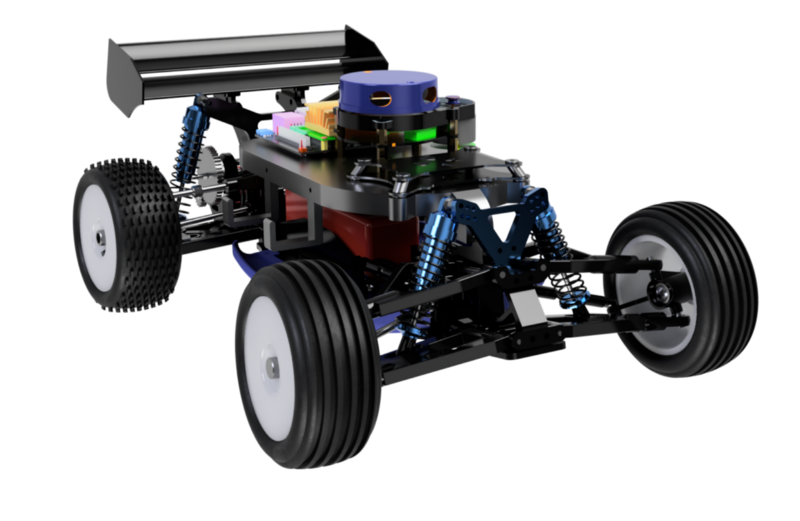

# McJetson
Building an Autonomous RC Car using the Robotic Operating System (ROS)

**Project Goal:** Transform an off-road RC car into an autonomous system with on-board processing using ROS for mapping,
localization and planning routes based on waypoints while avoiding obstacles.

**Youtube Tutorials:**
* [Building an Autonomous RC Car | Part 1](https://www.youtube.com/watch?v=tFP9U9C-gqY)
* Next videos will come soon!
